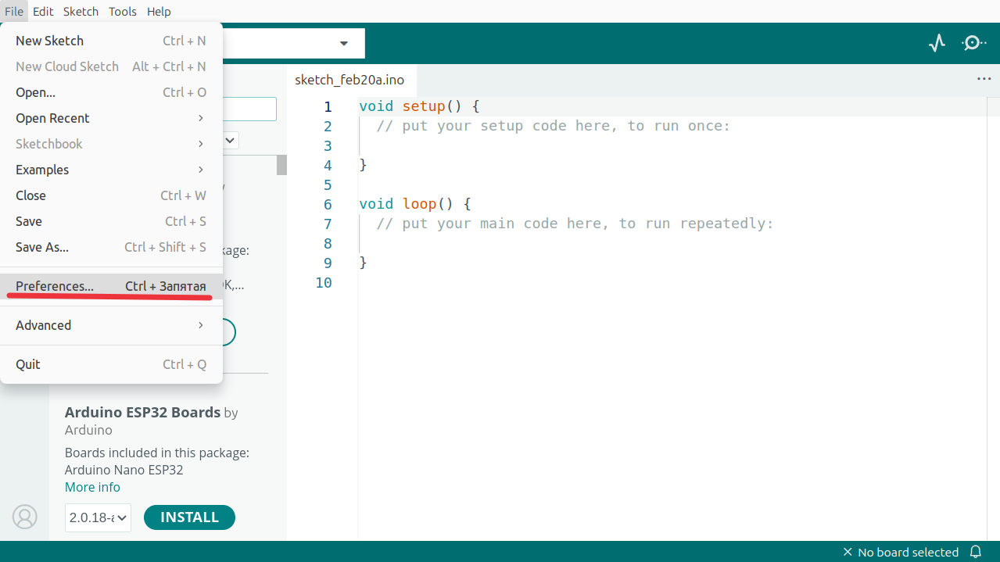
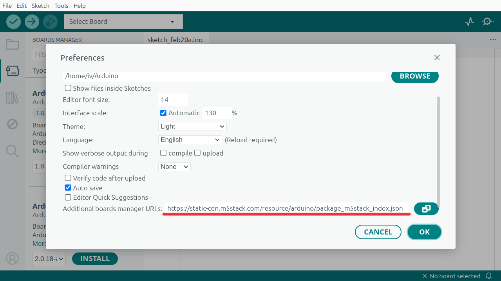
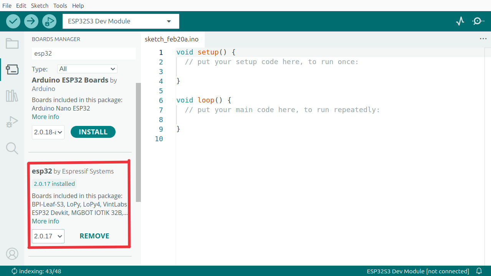
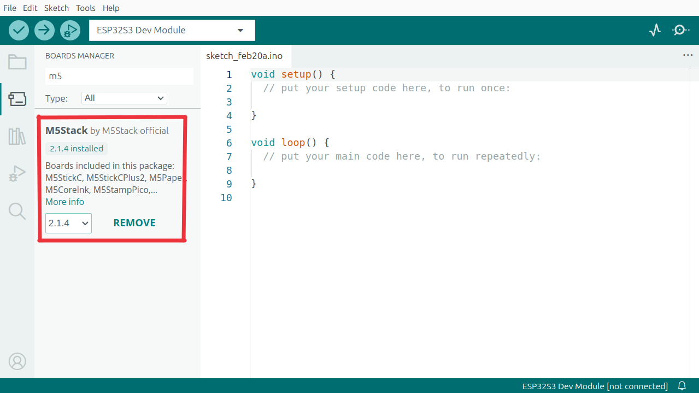
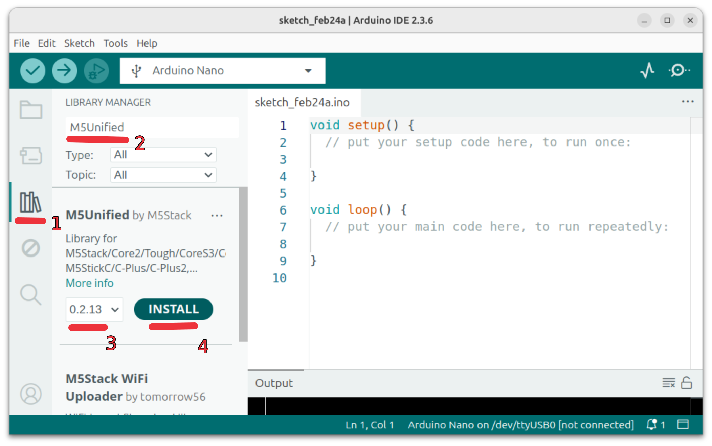
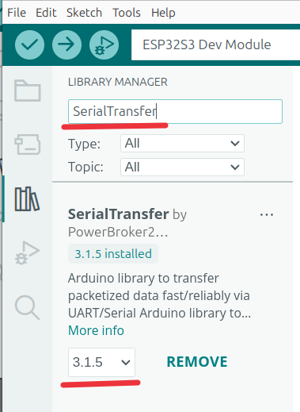
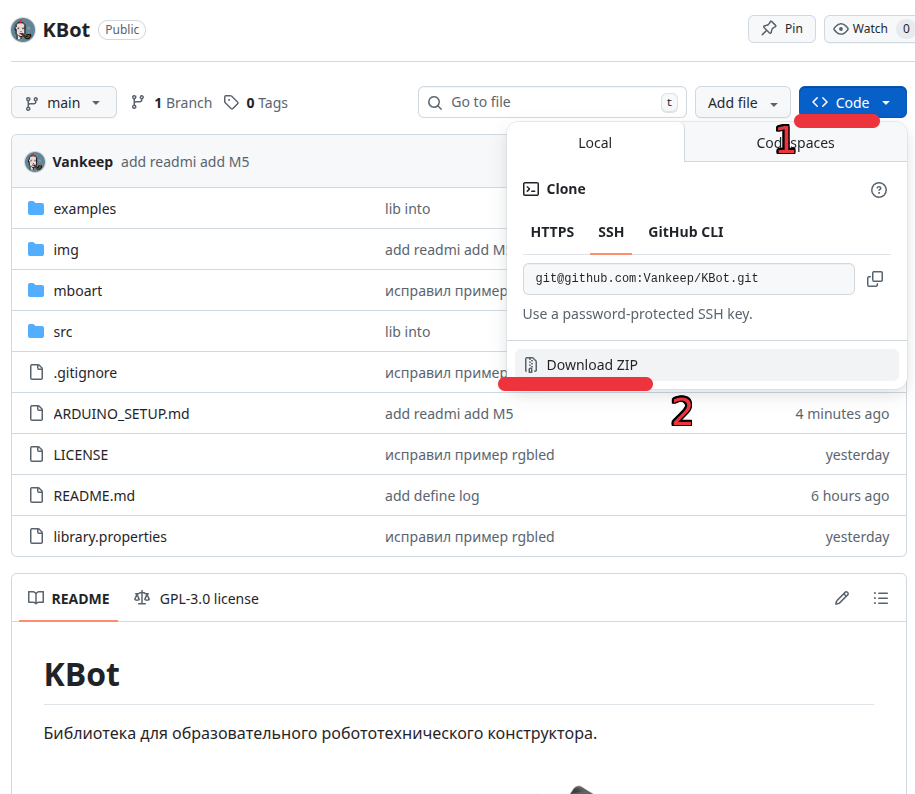
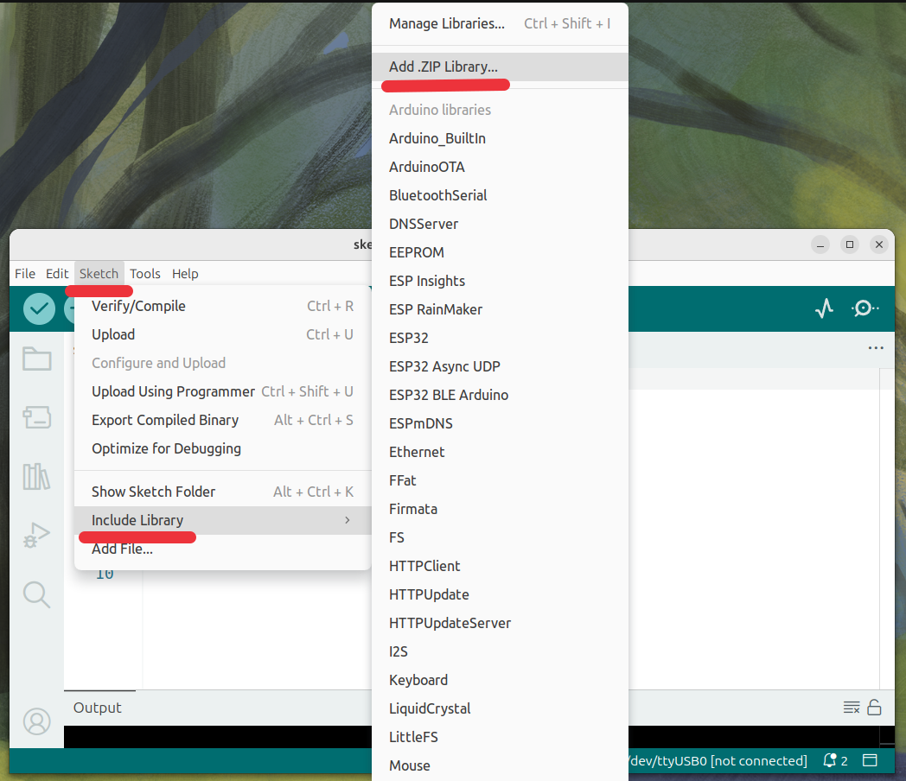
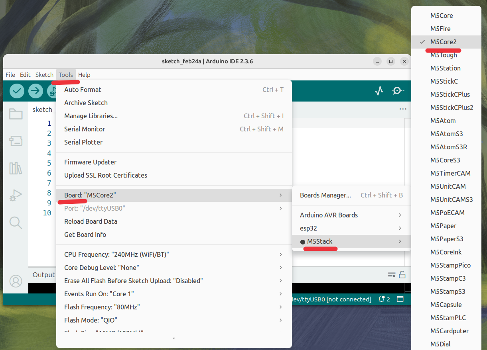

# Установка и настройка Arduino IDE

## Установка Arduino IDE

1. Скачайте Arduino IDE версии 2.x с официального сайта: https://www.arduino.cc/en/software
2. Установите согласно инструкциям для вашей ОС

## Добавление плат ESP32 и M5Stack

1. Откройте Arduino IDE
2. Перейдите в `File` → `Preferences`



3. В поле `Additional Boards Manager URLs` вставьте ссылку:
   ```
   https://static-cdn.m5stack.com/resource/arduino/package_m5stack_index.json
   ```



4. Откройте `Tools` → `Board` → `Boards Manager`
5. Найдите и установите:

   - `M5Stack` версия `2.1.4`



   - `esp32` версия `2.0.17`


   
## Установка библиотеки M5
1. Слева нажмите на "Library Manager"
2. В строке поиска введите `M5Unified`
3. Выберите версию `0.2.13`
4. Нажмите **INSTALL**




В появившемся окне нажать **INSTALL ALL**



## Установка библиотеки KBot
Открыть https://github.com/Vankeep/KBot

1. Нажмите кнопку **Code**
2. Выберите **Download ZIP**




Сохраните в загрузки.

Откройте Arduino IDE. Далее `Sketch` → `Include Library` → `Add .ZIP Library`



## Финальная настройка

Для того чтобы прошить M5Core2 необходимо выбрать плату в Arduino IDE. 

`Tools` → `Board` → `M5Stack` → `M5Core2`



После выполнения всех шагов библиотека KBot будет готова к использованию!
