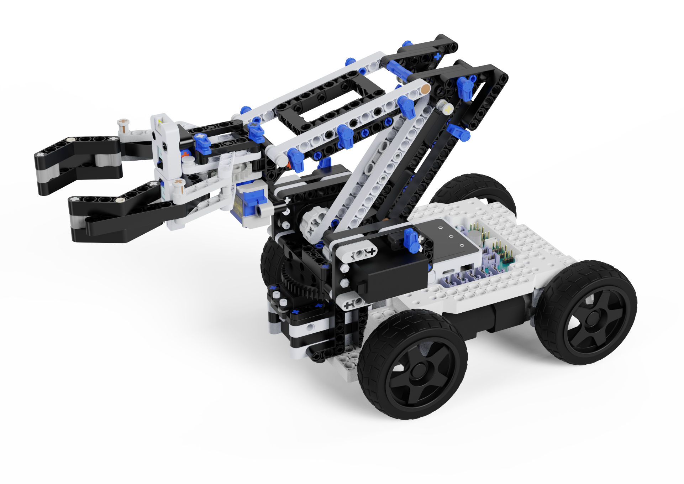

= KBot
:toc: macro
:toc-title: Содержание
:toclevels: 2
:icons: font
:source-highlighter: highlight.js

Библиотека для образовательного робототехнического конструктора.

== Быстрый старт

Перед началом работы необходимо установить и настроить Arduino IDE. Подробная инструкция: link:ARDUINO_SETUP.md[**Установка и настройка Arduino IDE**]

toc::[]

== API

== Инициализация

Каждая программа для робота начинается с этого кода:

[source,cpp]
----
#include <KBot.h>

KBot bot;

void setup() {
    bot.begin();
}

void loop() {
    bot.update();
}
----

IMPORTANT: В функции `loop()` обязательно вызывайте `bot.update()` в начале!

<<Содержание,↑ К содержанию>>

'''

== Ультразвуковой датчик расстояния

Измеряет расстояние до объекта с помощью ультразвука (как у летучих мышей).

**Подключение:** I2C порт

**Объект:** `ultrasonic`

**Методы:**
[source,cpp]
----
// Получить расстояние до объекта в миллиметрах
long getDistanceMm();
----

**Пример использования:** `sonar.ino`

<<Содержание,↑ К содержанию>>

'''

== Датчик расстояния ToF (Time-of-Flight)

Более точный датчик расстояния, использует лазер.

**Подключение:** I2C порт

**Объект:** `tof`

**Методы:**
[source,cpp]
----
// Получить расстояние до объекта в миллиметрах
long getDistanceMm()
----

**Пример использования:** link:examples/tof/tof.ino[tof.ino]

<<Содержание,↑ К содержанию>>

'''

== Датчик угла

Датчик угла (потенциометр), который измеряет угол от 0 до 180 градусов.

**Подключение:** Разъемы XP8, XP9, XP10, XP11

**Доступные объекты:** `angleSensor1`, `angleSensor2`, `angleSensor3`, `angleSensor4`

**Методы:**
[source,cpp]
----
//Инициализация датчика на указанном разъеме
void begin(Connector::Name name);
// Получить угол поворота в градусах (0-180)
int getAngle();
----

**Пример использования:** `angleSensor.ino`

<<Содержание,↑ К содержанию>>

'''

== Кнопки и концевые выключатели

Кнопка нажимается пальцем, концевой выключатель срабатывает при столкновении.

**Подключение:** Разъемы XP8, XP9, XP10, XP11, XP13

**Доступные объекты:**

* `button1`, `button2` — обычные кнопки
* `limitSwitch1`, `limitSwitch2` — концевые выключатели

**Методы:**
[source,cpp]
----
// Инициализация на указанном разъеме
void begin(Connector::Name name);
// Возвращает true один раз при нажатии
bool isPressed();
// Возвращает true один раз при отпускании
bool isReleased();
// Возвращает true пока кнопка удерживается
bool isHeld();
----

**Пример использования:** `button.ino`

<<Содержание,↑ К содержанию>>

'''

== Датчик линии

Датчик для обнаружения черной линии на белом фоне (или наоборот).

**Подключение:** Разъемы XP8, XP10, XP11, XP13

**Доступные объекты:** `lineSensor1`, `lineSensor2`, `lineSensor3`, `lineSensor4`

**Методы:**
[source,cpp]
----
// Инициализация датчика на указанном разъеме
void begin(Connector::Name name);
// Возвращает true, если датчик видит линию
bool isOnLine();
// Возвращает true один раз при обнаружении линии
bool isDetected();
// Возвращает true один раз при потере линии
bool isLost();
----

**Пример использования:** `lineSensor.ino`

<<Содержание,↑ К содержанию>>

'''

== Датчик цвета

Датчик для распознавания цветов.

**Подключение:** I2C порт

**Объект:** `colorSensor`

**Методы:**
[source,cpp]
----
// Калибровка по белому цвету
void calibrateWhite();
// Получить значения RGB цвета
void getRGB(int &r, int &g, int &b);
// Проверить, красный ли это цвет
bool isRed(int r, int g, int b);
// Проверить, зеленый ли это цвет
bool isGreen(int r, int g, int b);
// Проверить, синий ли это цвет
bool isBlue(int r, int g, int b);
// Проверить, белый ли это цвет
bool isWhite(int r, int g, int b);
// Проверить, черный ли это цвет
bool isBlack(int r, int g, int b);
----

**Пример использования:** `colorSensor.ino`

<<Содержание,↑ К содержанию>>

'''

== Датчик IMU (акселерометр и гироскоп)

Датчик для измерения положения робота в пространстве: углы наклона, крена, ускорение и угловую скорость.

**Подключение:** I2C порт

**Объект:** `imu`

**Методы:**
[source,cpp]
----
// Получить угол наклона (pitch) в градусах
int getPitch();
// Получить угол крена (roll) в градусах
int getRoll();
// Получить ускорение по оси X
int getAccelX();
// Получить ускорение по оси Y
int getAccelY();
// Получить ускорение по оси Z
int getAccelZ();
// Получить угловую скорость по оси X
int getGyroX();
// Получить угловую скорость по оси Y
int getGyroY();
// Получить угловую скорость по оси Z
int getGyroZ();
----

**Пример использования:** `imu.ino`

<<Содержание,↑ К содержанию>>

'''

== Моторы

Управление колесами робота. Скорость от -200 (назад) до 200 (вперед).

**Имена:** XP14A, XP15A, XP14B, XP15B (указаны на плате kbotBoard)

**Объект:** `wheel`

**Методы:**
[source,cpp]
----
// Управление левыми и правыми моторами (-200...200)
void drive(int left, int right);
// Управление отдельным мотором (-200...200)
void drive(Wheel::Name motor, int speed);
// Остановить один мотор
void stop(Wheel::Name motor);
// Остановить все моторы
void stopAll();
----

**Пример использования:** `wheel.ino`

<<Содержание,↑ К содержанию>>

'''

== Сервоприводы

Поворачиваются на заданный угол от 0 до 180 градусов.

**Подключение:** Разъемы SRV1, SRV2, SRV3, SRV4

**Объекты:** `servo1`, `servo2`, `servo3`, `servo4`

**Методы:**
[source,cpp]
----
// Инициализация сервопривода на указанном разъеме
void begin(ServoPin::Name name);
// Установить угол сервопривода (0-180)
void setAngle(int angle);
// Получить текущий угол сервопривода
int getAngle();
// Вернуть сервопривод в начальное положение (90°)
void goHome();
----

**Пример использования:** `servo.ino`

<<Содержание,↑ К содержанию>>

'''

== Светодиоды платы kbotBoard

4 встроенных RGB светодиода на нижней плате (kbotBoard).

**Имена:** DA9, DA14, DA20, DA26 (указаны рядом со светодиодом)

**Объект:** `kbotBoardLed`

**Методы:**
[source,cpp]
----
// Установить RGB цвет (0-255 для каждого цвета)
void color(Led::Name led, int red, int green, int blue);
// Установить цвет из готовых
void color(Led::Name led, Led::Color color);
// Установить цвет всех светодиодов
void colorAll(Led::Color color);
// Выключить один светодиод
void off(Led::Name led);
// Выключить все светодиоды
void offAll();
----

**Готовые цвета:** `Led::Color::RED`, `Led::Color::GREEN`, `Led::Color::BLUE`, `Led::Color::YELLOW`, `Led::Color::CYAN`, `Led::Color::MAGENTA`, `Led::Color::BLACK`

**Пример использования:** `kbotBoardLed.ino`

<<Содержание,↑ К содержанию>>

'''

== RGB LED Unit

Управление RGB светодиодной лентой (адресные светодиоды WS2812).

**Подключение:** Разъемы XP8, XP9, XP10, XP11, XP12, XP13

**Объект:** `rgbLed`

**Методы:**
[source,cpp]
----
// Инициализация ленты (указать пин и количество светодиодов)
void begin(Connector::Name name, int numLeds = 3);
// Установить цвет одного светодиода (0-255 для каждого цвета)
void setColor(int pixel, int r, int g, int b);
// Установить готовый цвет
void setColor(int pixel, Color::Name color);
// Установить цвет всех светодиодов
void setColorAll(int r, int g, int b);
// Установить готовый цвет для всех
void setColorAll(Color::Name color);
// Установить яркость (0-255)
void setBrightness(int brightness);
// Выключить все светодиоды
void clear();
// Получить количество светодиодов
int getNumLeds();
----

**Готовые цвета:** `Led::Color::RED`, `Led::Color::GREEN`, `Led::Color::BLUE`, `Led::Color::YELLOW`, `Led::Color::CYAN`, `Led::Color::MAGENTA`, `Led::Color::BLACK`

**Пример использования:** `rgbLed.ino`

<<Содержание,↑ К содержанию>>

'''

== Зуммер (Buzzer)

Звуковой динамик для воспроизведения тонов и мелодий.

**Подключение:** Разъемы XP8, XP9, XP10, XP11, XP12, XP13

**Объект:** `buzzer`

**Методы:**
[source,cpp]
----
// Инициализация зуммера на указанном разъеме
void begin(Connector::Name name);
// Воспроизвести тон с указанной частотой (в Гц) и длительностью (в мс). Если duration = 0, тон будет звучать постоянно
void tone(int frequency, unsigned long duration = 0);
// Остановить воспроизведение звука
void noTone();
----

**Пример использования:** `buzzer.ino`

<<Содержание,↑ К содержанию>>

'''

== OLED дисплей

Экран для вывода текста и чисел (4 строки).

**Объект:** `oled`

**Методы:**
[source,cpp]
----
// Вывод данных в строку 1
void printStr1(...);
// Вывод данных в строку 2
void printStr2(...);
// Вывод данных в строку 3
void printStr3(...);
// Вывод данных в строку 4
void printStr4(...);
// Очистить весь дисплей
void clear();
----

**Что можно выводить:**

Все функции `printStr1-4` умеют выводить:
[source,cpp]
----
// Текст
bot.oled.printStr1("Привет");
// Целые числа
bot.oled.printStr2(123);
// Большие числа
bot.oled.printStr3(987654L);
// Дробные числа
bot.oled.printStr4(3.14);
// Дробные числа указанием точности
bot.oled.printStr4(3.14159, 3);
----

**Пример:** TODO добавить пример

<<Содержание,↑ К содержанию>>

'''

== Сенсорные кнопки экрана M5Stack

4 кнопки на сенсорном экране M5Stack. На них можно вывести текст.

**Доступные объекты:** `sensorBTN1`, `sensorBTN2`, `sensorBTN3`, `sensorBTN4`

**Методы:**
[source,cpp]
----
// Установить текст на кнопке
void setText(const char* text);
// Проверить, нажата ли кнопка (возвращает true один раз при нажатии)
bool isClick();
----

**Пример использования:** `sensorButton.ino`

<<Содержание,↑ К содержанию>>

'''

== Таймеры

Таймеры для отсчета времени. Можно запустить на одно срабатывание или повторяющийся.

**Доступные объекты:** `timer1`, `timer2`, `timer3`, `timer4`

**Методы:**
[source,cpp]
----
// Запустить таймер на один раз (время в миллисекундах)
void startOnce(uint32_t ms);
// Запустить повторяющийся таймер (время в миллисекундах)
void startEvery(uint32_t ms);
// Остановить таймер
void stop();
// Сбросить таймер
void reset();
// Проверить, сработал ли таймер (true один раз при срабатывании)
bool isReady();
// Проверить, работает ли таймер
bool isActive();
// Проверить, завершился ли таймер
bool isDone();
----

**Пример использования:** `timer.ino`

<<Содержание,↑ К содержанию>>

'''

== Таблица совместимости датчиков и разъемов

[cols="1,1", options="header"]
|===
| Датчик/Устройство | Разъемы подключения

| Ультразвуковой датчик | I2C
| ToF датчик расстояния | I2C
| Датчик цвета | I2C
| Датчик IMU | I2C
| OLED дисплей | I2C
| Датчик угла | XP8, XP9, XP10, XP11
| Кнопка / Концевой выключатель | XP8, XP9, XP10, XP11, XP13
| Датчик линии | XP8, XP10, XP11, XP13
| RGB светодиодная лента | XP8, XP9, XP10, XP11, XP12, XP13
| Зуммер | XP8, XP9, XP10, XP11, XP12, XP13
| Сервопривод | SRV1, SRV2, SRV3, SRV4
| Моторы | XP14A, XP15A, XP14B, XP15B (встроенные)
| Светодиоды платы | DA9, DA14, DA20, DA26 (встроенные)
| Сенсорные кнопки | Встроенные в экран M5Stack
|===

<<Содержание,↑ К содержанию>>

== Лицензия

Образовательный проект Kobak